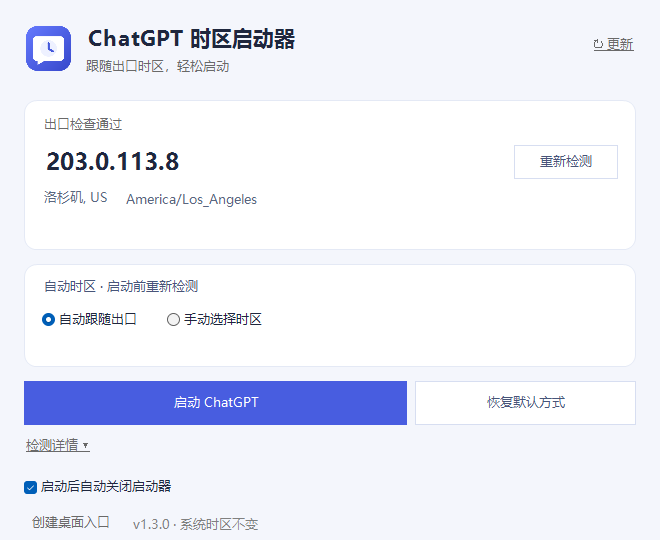

<p align="center"></p>

# ChatGPT 时区启动器

一个免安装的 Windows 小工具：启动前检查 ChatGPT 当前出口，按需设置本次进程的时区，**不改 Windows 系统时区**。

[下载最新版](https://github.com/404elf/chatgpt-timezone-launcher/releases/latest) · [反馈问题](https://github.com/404elf/chatgpt-timezone-launcher/issues) · [更新日志](CHANGELOG.md)

<p align="center"></p>

## 开始使用

1. 下载最新版的 Windows x64 EXE，放到普通文件夹中运行，无需安装 .NET 或管理员权限。
2. 选择「自动跟随出口」或「手动选择时区」。
3. 点击「启动 ChatGPT」。启动前会重新检查出口，旧结果不会用于放行。

如果 ChatGPT 已经在运行，改变时区需要重启客户端。启动器会先询问，再请求正常退出；不会强制结束你的 ChatGPT。

## 选哪个模式？

| 方式 | 时区来自哪里 | 适合什么时候 |
|---|---|---|
| 自动跟随出口 | 当前 ChatGPT 出口 IP 的 IANA 时区 | 希望时区随代理节点变化 |
| 手动选择时区 | 你搜索并选择的时区 | 希望固定使用某个时区 |
| 恢复默认方式 | Windows/ChatGPT 的默认行为，不注入 TZ | 希望停用时区覆盖 |

**三种方式都会先检查出口地区。** 手动选择 Asia/Shanghai 不代表 IP 在中国大陆，也不会绕过地区保护。

## 出口检测与保护

启动器先访问 ChatGPT/OpenAI 域名的 trace，取得这些请求的出口 IP；再查询**这个指定 IP**的地区和时区。规则分流时，普通网络出口或 GeoIP 网站自身的出口不能代替 ChatGPT 出口。

- 地区范围依据 [OpenAI 支持地区清单](https://help.openai.com/en/articles/7947663-chatgpt-supported-countries)，代码清单核对日期为 2026-10-01。
- 中国大陆、香港、澳门等不支持地区，或地区未知、检测失败，会提示「IP 错误」并停止启动。
- trace 已确认地区不支持时，直接返回，不再等待第三方时区查询。
- 检查通过前，不会请求关闭或重启已运行的 ChatGPT。

### 切换代理后，不用重开启动器

直接点击「重新检测」或「启动 ChatGPT」。每次检测都会读取当前 Windows 代理/PAC 设置，创建新连接，避免沿用此前直连或旧代理的连接。

v1.3.0 同时缩短了等待：

- 优先检查 chatgpt.com；主入口失败后才检查其他 OpenAI 域名。
- 时区查询并行进行，取首个完整且 IP 匹配的结果，并取消其余请求。
- 网络检测总时限约 **7 秒**。这只计出口检查，不包含 Windows 启动客户端和客户端自身的账号登录时间。

代理节点延迟、DNS、服务限流仍会影响实际用时。切换网络途中检查失败时，确认网络连接完成后再点一次即可；不会用旧 IP 猜测成功。

## 小设置

- **启动后自动关闭启动器**：可勾选，会记住选择。启动失败、IP 错误或取消重启时，窗口会保留；默认启动方式还会等待检测到客户端进程。
- **↻ 更新**：打开窗口时静默检查 GitHub 最新正式版，有更新时显示提示。点击可下载并校验 SHA-256，再关闭启动器、手动替换旧文件。原设置继续使用。
- **检测详情**：平时收起，排查问题时展开查看。
- **创建桌面入口**：生成桌面快捷方式。

窗口支持拉伸，较小窗口可以滚动查看内容。自包含单文件 EXE 适用于 Windows 10/11 x64；ARM64 需另行构建。

## 配置与隐私

配置文件：<code>%LocalAppData%\ChatGPTTimezoneLauncher\settings.json</code>。保存前会生成 .bak 备份；配置损坏时保留原文，并使用安全默认设置。

启动器不修改 Windows 时区、注册表、全局 TZ 或 ChatGPT 文件，也不读取聊天内容。trace 服务可见请求的公网 IP；GeoIP 服务会收到要查询的指定 IP。更新入口访问 GitHub，没有额外遥测。

GeoIP 数据可能有误差。保护按国家/地区判断，无法识别官方清单中部分地区的局部例外；启动后不持续监控 IP。

## 构建与验证

需要 Windows 与 .NET 8 SDK：

```powershell
.\build.ps1
```

脚本运行测试，发布自包含 EXE，再检查最终程序在首次启动和损坏配置情况下能否打开。输出为 <code>dist\win-x64\ChatGPT时区启动器.exe</code>。

v1.3.0 测试覆盖代理切换、慢请求取消、地区拦截、窗口缩放、配置与包启动。具体结果及真实客户端验证范围见 [TEST-RESULTS.md](TEST-RESULTS.md)。

- 图标原稿：[launcher.svg](assets/launcher.svg)；可用 Pillow 运行 <code>python tools/create_icon.py</code> 重新生成 ICO/PNG，正常构建不需要 Python。
- 新版客户端的 Windows 包身份启动修复见 [v1.1.2 说明](docs/RELEASE_NOTES_v1.1.2.md)。
- 启动异常日志：<code>%LocalAppData%\ChatGPTTimezoneLauncher\logs</code>。

## 致谢

功能构想参考了 Opus94 分享的「ChatGPT 时区启动器」截图与使用说明。本仓库独立实现，没有复制参考工具的源码或二进制文件。若有原分享的长期有效链接，欢迎通过 Issue 补充出处。
